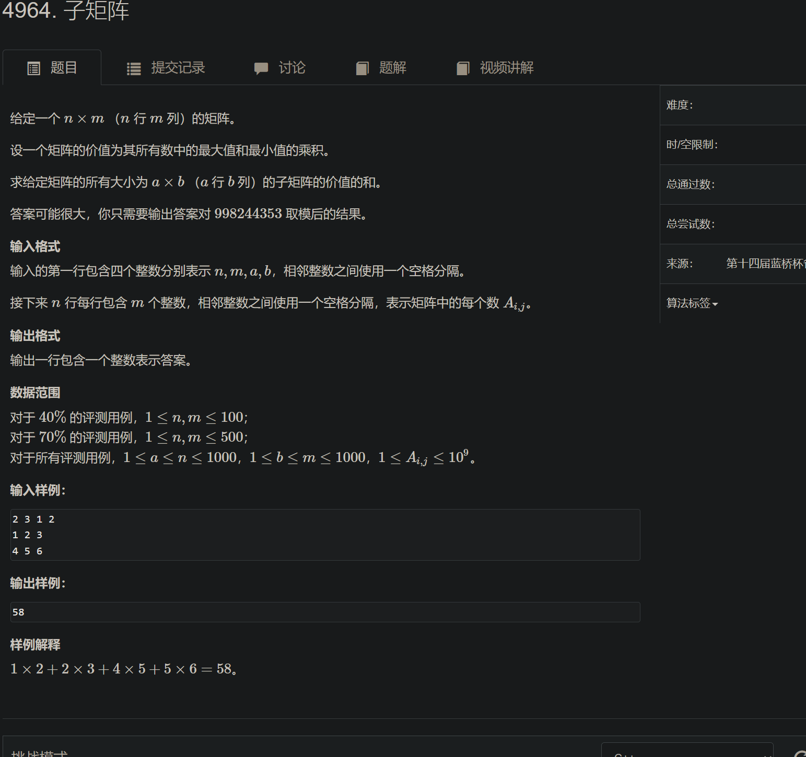

```c++
#include <bits/stdc++.h>
#define endl '\n'
using namespace std;
typedef pair<int,int> pii;

const long long mod = 998244353;
const int N = 1010;

int n,m,A,B;
int w[N][N];
int rmax[N][N],rmin[N][N];
int q[N];

void get_max(int a[], int b[], int tot, int k)
{
    int hh = 0, tt = -1;
    for (int i = 0; i < tot; i++)
    {
        if (hh <= tt && q[hh] <= i - k) hh++;
        while (hh <= tt && a[q[tt]] <= a[i]) tt--;
        q[ ++ tt] = i;
        b[i] = a[q[hh]];
    }

}


void get_min(int a[], int b[], int tot, int k)
{
    int hh = 0, tt = -1;
    for (int i = 0; i < tot; i++)
    {
        if (hh <= tt && q[hh] <= i - k) hh++;
        while (hh <= tt && a[q[tt]] >= a[i]) tt--;
        q[ ++ tt] = i;
        b[i] = a[q[hh]];
    }
}

void solve()
{
    cin >> n >> m >> A >> B;
    for (int i = 0; i < n; i++)
    {
        for (int j = 0; j < m; j++)
        {
            cin >> w[i][j];
        }
    }

    for (int i = 0; i < n; i++)
    {
        get_max(w[i], rmax[i], m, B);
        get_min(w[i], rmin[i], m, B);
    }

    int res = 0;

    int a[N], b[N], c[N];
    for (int i = B - 1; i < m; i++)
    {
        for (int j = 0; j < n; j++) a[j] = rmax[j][i];
        get_max(a, b, n, A);
        for (int j = 0; j < n; j++) a[j] = rmin[j][i];
        get_min(a, c, n, A);
        for (int j = A - 1; j < n; j++)
        {
            res = (res + (long long)b[j] * c[j]) % mod;
        }
    }

    cout << res << endl;

}
int main()
{
    ios::sync_with_stdio(false);
    cin.tie(0),cout.tie(0);

    solve();

    return 0;
}
```


