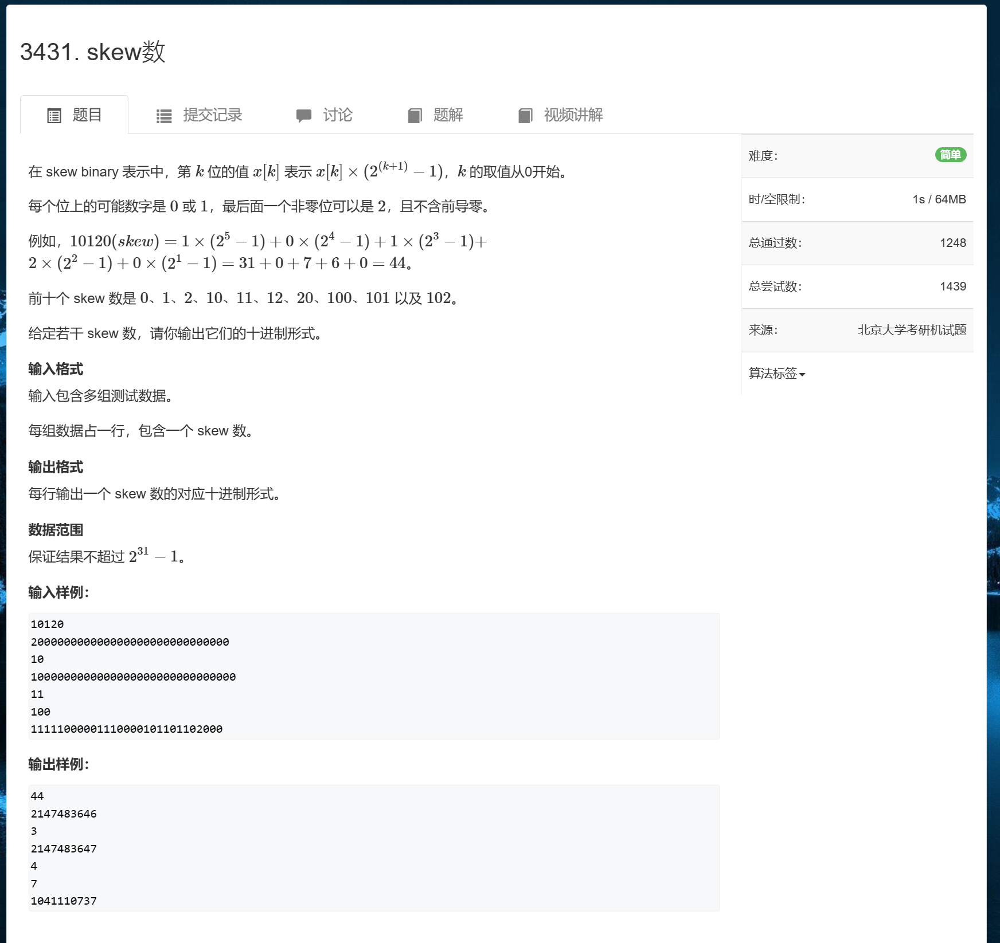

```c++
#include <bits/stdc++.h>
#define endl "\n"

using namespace std;
typedef pair<int,int> pii;

int main()
{
    ios::sync_with_stdio(false);
    cin.tie(0),cout.tie(0);

    string s;
    while (cin >> s)
    {
        int ans = 0;

        for (int i = 0; i < s.size(); i++)
        {
            ans +=(s[i] - '0') * ((1 << (s.size() - i)) - 1);
        }

        cout << ans << endl;
    }
    return 0;
}
```


