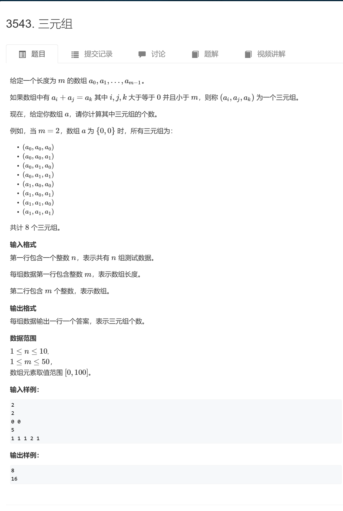

```c++
#include <bits/stdc++.h>
#define endl "\n"

using namespace std;
typedef pair<int,int> pii;


void solve()
{
    int n;
    cin >> n;
    vector<int> v(n);

    for (int i = 0; i < n; i++)  cin >> v[i];

    int ans = 0;
    for (int i = 0; i < n; i++)
    {
        for (int j = 0; j < n; j++)
        {
            for (int k = 0; k < n; k++)
            {
                if (v[i] + v[j] == v[k]) ans++;
            }
        }
    }
    
    cout << ans << endl;
}
int main()
{
    ios::sync_with_stdio(false);
    cin.tie(0),cout.tie(0);
    int t;
    cin >> t;
    while (t--)
    {
        solve();
    }

    return 0;
}
```

