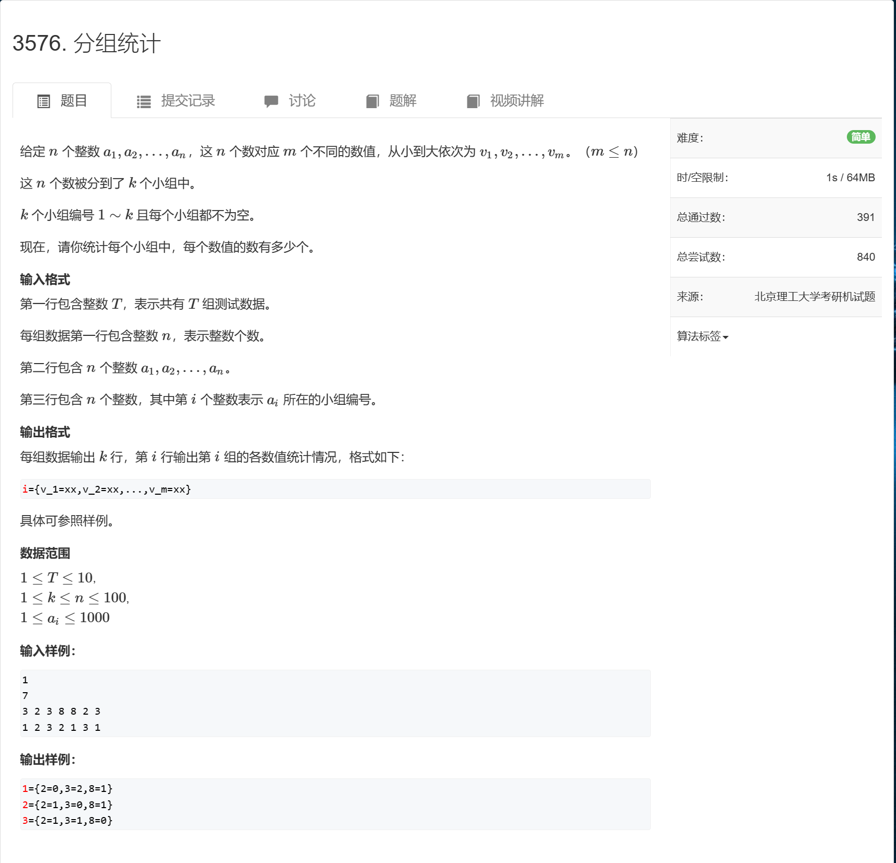

```c++
#include <bits/stdc++.h>

using namespace std;

void solve()
{
    map<int,map<int,int>> m;
    int n;
    cin >> n;
    int q[n + 1];
    set<int> se;

    for (int i = 0; i < n; i++)
    {
        cin >> q[i];
        se.insert(q[i]);
    }

    for (int i = 0; i < n; i++)
    {
        int x;
        cin >> x;
        m[x][q[i]]++;
    }

    for (auto item : m)
    {
        cout << item.first << "=" <<  "{";
        int cnt = 0;
        for (auto it : se)
        {
            cnt++;
            cout << it << "=" << item.second[it];
            if (cnt < se.size()) cout << ",";
        } 
        cout << "}" << endl;
    }
}
int main()
{
    ios::sync_with_stdio(false);
    cin.tie(0),cout.tie(0);
    int t;
    cin >> t;
    while (t--)
    {
        solve();
    }
    return 0;
}
```

