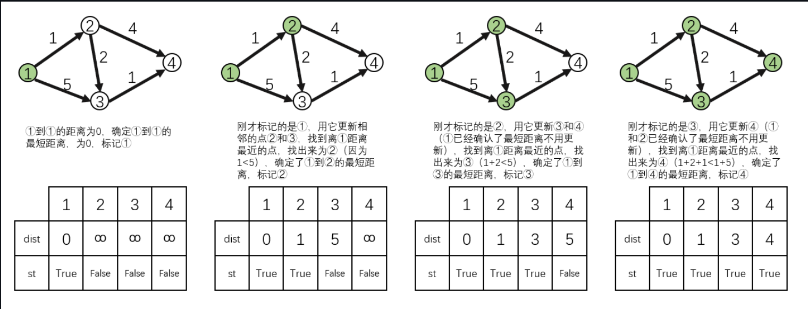

# 最短路

## 朴素Dijkstra



```C++
#include <bits/stdc++.h>
#define endl "\n"

using namespace std;
typedef pair<int,int> pii;
const int N = 510;
int g[N][N],dist[N];
int st[N];
int n,m;

void dijkstra()
{
    memset(dist,0x3f,sizeof dist); //初始化所有距离为正无穷
    
    dist[1] = 0;//1到1的距离为1

    for (int i = 1; i <= n; i++)
    {
        int t = -1;
        for (int j = 1; j <= n; j++)
        {
            if (!st[j] && (t == -1 || dist[t] > dist[j]))
            {
                t = j;
            }//找到未被标记的距离1最近的点
        }
        st[t] = true;//标记该点即为1到其的最短路径已经确定

        for (int j = 1; j <= n; j++)
        {
            dist[j] = min(dist[j],dist[j] + g[t][j]); // 用这个点更新1到其他点的最短距离 1-t + t-j，更新1-j的距离
        }      
    }

    if (dist[n] == 0x3f3f3f3f) cout << -1 << endl;
    else cout << dist[n] << endl;
}
int main()
{
    ios::sync_with_stdio(false);
    cin.tie(0),cout.tie(0);
    
    cin >> n >> m;

    memset(g,0x3f,sizeof g);

    for (int i = 1; i <= m; i++)
    {
        int a,b,c;
        cin >> a >> b >> c;
        g[a][b] = min(g[a][b],c);

    }
    dijkstra();
    return 0;
}
```

