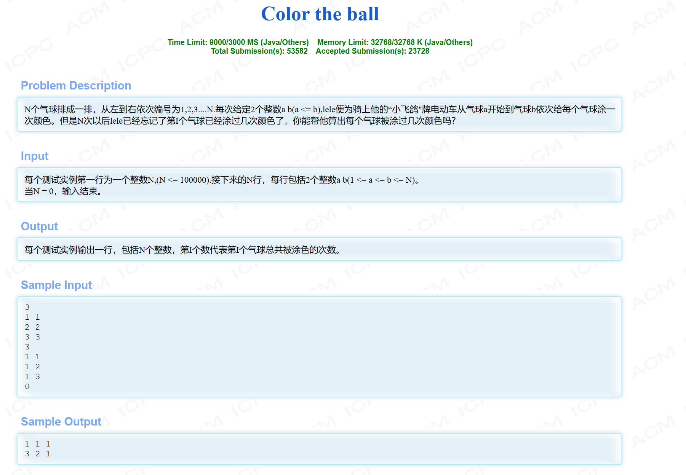

# 基本算法

## 前缀和与差分

### hdu 1556




```C++
#include <bits/stdc++.h>
#define endl "\n"

using namespace std;
typedef pair<int,int> pii;

const int N = 100010;
int a[N],d[N];

void solve()
{
    int n;
    while (cin >> n && n != 0)
    {
        memset(a,0,sizeof a),memset(d,0,sizeof d);
        for (int i = 1;i <= n; i++)
        {
            int l, r;
            cin >> l >> r;
            d[l]++,d[r + 1]--;
        }
        for (int i = 1; i <= n; i++)
        {
            a[i] = a[i - 1] + d[i];
        }
        for (int i = 1; i <= n; i++)
        {
            if (i != n) cout << a[i] << " ";
            else cout << a[i] << endl;
        }
    }

}
int main()
{
    ios::sync_with_stdio(false);
    cin.tie(0),cout.tie(0);
    
    solve();    
    return 0;
}
```

