# 基本数据结构

## 二叉树

### P1087

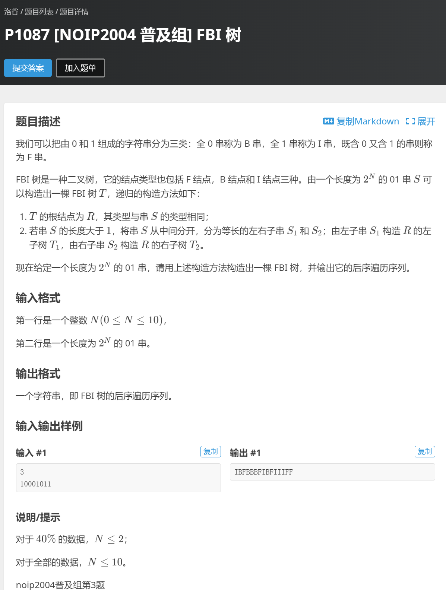


 ```C++
 #include <bits/stdc++.h>
 #define endl "\n"
 
 using namespace std;
 typedef pair<int,int> pii;
 
 int n;
 string s;
 void make(int l,int r)
 {
     int mid = l + r >> 1;
     if (l != r) //长度不为1
     {
         make(l,mid);
         make(mid + 1,r);
     }
     int a = 0, b = 0;
     for (int i = l; i <= r; i++)
     {
         if (s[i] == '0') a++;
         else b++;
     }
     if (a && b) cout << "F";
     else if (a) cout << "B";
     else cout << "I";
 }
 void solve()
 {
     cin >> n;
     cin >> s;
     s = ' ' + s;
     make(1, 1 << n);
 }
 int main()
 {
     ios::sync_with_stdio(false);
     cin.tie(0),cout.tie(0);
     
     solve();    
     return 0;
 }
 ```


### p1030


```C++
#include <bits/stdc++.h>
#define endl "\n"

using namespace std;
typedef pair<int,int> pii;


void pre(string in,string post)
{
    if (in.size() > 0)
    {
        char root = post[post.size() - 1];
        cout << root;
        int k = in.find(root);
        pre(in.substr(0,k),post.substr(0,k)); //递归左子树
        pre(in.substr(k + 1),post.substr(k,in.size() - k - 1)); // 递归右子树
    }
}
void solve()
{
    string in, post;
    cin >> in >> post;
    pre(in, post);
    cout << endl;
}
int main()
{
    ios::sync_with_stdio(false);
    cin.tie(0),cout.tie(0);
    
    solve();    
    return 0;
}
```


### P1305


```C++
#include <bits/stdc++.h>
#define endl "\n"

using namespace std;
typedef pair<int,int> pii;
const int N = 1 << 26;
struct Node
{
    char value,lson,rson;
}tree[N];
int n;
string s;
char root;

void pre(char node)
{
    cout << node;
    if (tree[node].lson != '*') pre(tree[node].lson);
    if (tree[node].rson != '*') pre(tree[node].rson);
}
void solve()
{
    cin >> n;
    for (int i = 1; i <= n; i++)
    {
        cin >> s;
        if (i == 1) root = s[0];
        tree[s[0]].lson = s[1], tree[s[0]].rson = s[2];
    }
    pre(root);
}
int main()
{
    ios::sync_with_stdio(false);
    cin.tie(0),cout.tie(0);
    
    solve();    
    return 0;
}
```


### P1229

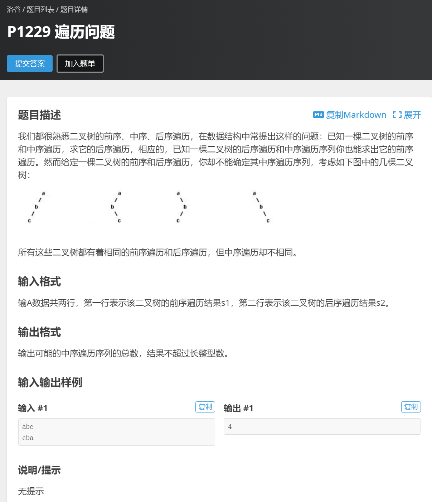


```C++
#include <bits/stdc++.h>
#define endl "\n"

using namespace std;
typedef pair<int,int> pii;

void solve()
{
    string s1, s2;
    cin >> s1 >> s2;
    int ans = 0;
    for (int i = 0; i < s1.size(); i++)
    {
        for (int j = 1; j < s2.size(); j++)
        {
            if (s1[i] == s2[j] && s1[i + 1] == s2[j - 1]) ans++;
        }
    }   
    cout << (1 << ans) << endl;
}
int main()
{
    ios::sync_with_stdio(false);
    cin.tie(0),cout.tie(0);
    
    solve();    
    return 0;
}
```


### P5018

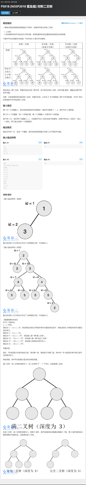

```C++
#include <bits/stdc++.h>
#define endl "\n"

using namespace std;
typedef pair<int,int> pii;

const int N = 1e6 + 10;
bool flag;

struct Node
{
    int value;
    int lson, rson;
}tree[N];

int dfs(int x,int y, int s)
{
    if (x == -1 && y == -1) return 0;
    if (x == -1 || y == -1 && x != y)
    {
        flag = 1;
        return 0;
    }
    if (tree[x].value != tree[y].value)
    {
        flag = 1;
        return 0;
    }
    return dfs(tree[x].lson, tree[y].rson, 2) + dfs(tree[x].rson, tree[y].lson, 2) + s;
}
void solve()
{
    int n; cin >> n;
    int ans = 1;
    for (int i = 1; i <= n; i++) cin >> tree[i].value;
    for (int i = 1; i <= n; i++) cin >> tree[i].lson >> tree[i].rson;
    for (int i = 1; i <= n; i++)
    {
        int s = dfs(tree[i].lson, tree[i].rson, 3);
        if (!flag) ans = max(ans, s);
        flag = 0;
    }
    cout << ans << endl;

}
int main()
{
    ios::sync_with_stdio(false);
    cin.tie(0),cout.tie(0);
    
    solve();    
    return 0;
}
```


### p2168

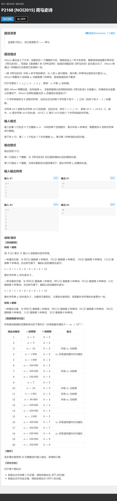

```C++
#include <bits/stdc++.h>
#define endl "\n"

using namespace std;
typedef pair<int,int> pii;


struct Tree
{
    long long w,h;
    bool operator < (const Tree & x) const
    {
        if (w != x.w) return w > x.w; //升序
        return h > x.h;
    }
};

priority_queue<Tree> q;

void solve()
{
    long long n, k;
    cin >> n >> k;
    for (int i = 1; i <= n; i++)
    {
        long long x;
        cin >> x;
        q.push((Tree){x,1});
    }
    if ((n - 1) % (k - 1) != 0)
    {
        for (int i = 1; i <= k - 1 - ((n - 1) % (k - 1)); i++) q.push((Tree){0,1});
    }
    long long ans = 0;
    long long top = 0;

    while (q.size() > 1)
    {
        long long sum = 0;
        long long h = 0;
        for (int i = 1; i <= k; i++)
        {
            sum += q.top().w;
            h = max(q.top().h, h);
            q.pop();
        }
        q.push((Tree){sum, h + 1});
        ans += sum;
        top = max(h, top);
    }
    cout << ans << endl;
    cout << top  << endl;

}
int main()
{
    ios::sync_with_stdio(false);
    cin.tie(0),cout.tie(0);

    solve();

    return 0;
}
```


# 基本算法


## 二分

### P1824

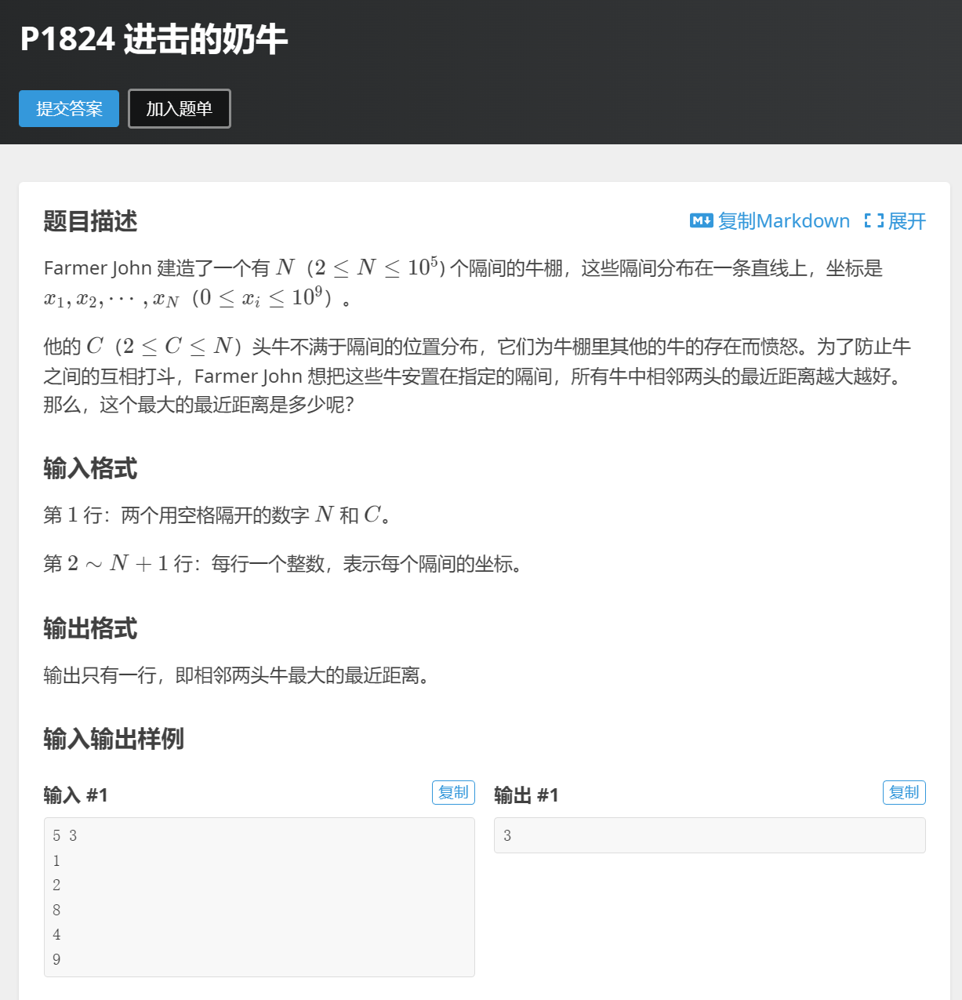

```C++
#include <bits/stdc++.h>
#define endl "\n"

using namespace std;
typedef pair<int,int> pii;
const int N = 1e5 + 10;
int n,c,x[N],ans;

bool check(int mid)
{
    int cnt = 1, p = 0;
    for (int i = 1; i < n; i++)
    {
        if (x[i] - x[p] >= mid)
        {
            cnt++;
            p = i;
        }
    }
    if (cnt >= c) return true;
    else return false;
}
void solve()
{
    cin >> n >> c;
    for (int i = 0; i < n; i++) cin >> x[i];
    sort(x,x + n);

    int l = 0, r = x[n - 1] - x[0];
    while (l < r)
    {
        int mid = (l + r) >> 1;
        if (check(mid))
        {
            ans = mid;
            l = mid + 1;
        }
        else r = mid;
    }
    cout << ans << endl;

}
int main()
{
    ios::sync_with_stdio(false);
    cin.tie(0),cout.tie(0);
    
    solve();    
    return 0;
}
```


### P1419


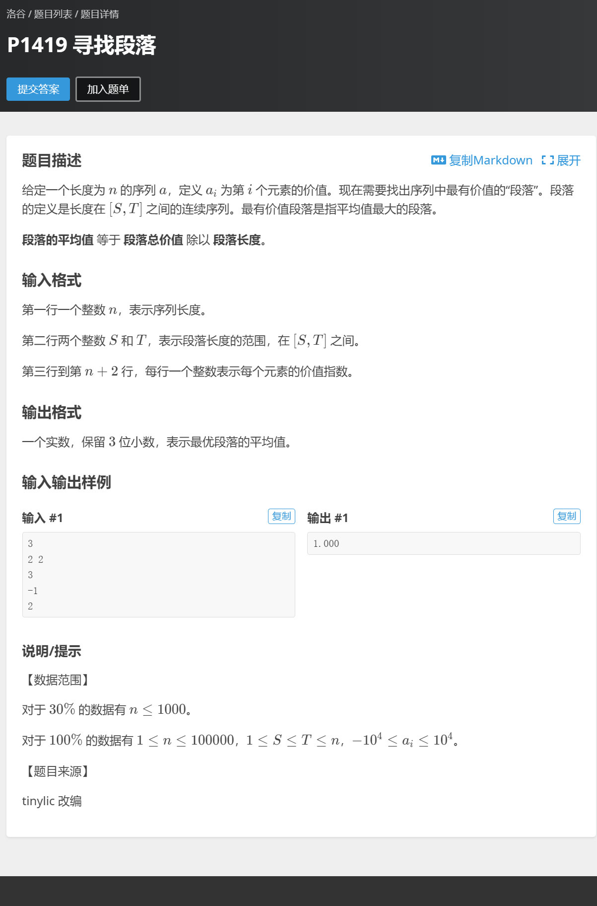

```
#include <bits/stdc++.h>
#define endl "\n"

using namespace std;
typedef pair<int,int> pii;
const int N = 1e5 + 10;
const double eps = 1e-5;
double v[N];
double a[N];
int n,s,t;

bool check(double mid)
{
    deque<int> de;
    for (int i = 1; i <= n; i++)
    {
        a[i] = v[i] - mid;
        a[i] += a[i - 1];
    }
    for (int i = 1; i <= n; i++)
    {
        if (i >= s)
        {
            while (!de.empty() && a[i - s] < a[de.back()]) de.pop_back();
            de.push_back(i - s);
        }
        if (!de.empty())
        {
            if (de.front() < i - t) de.pop_front();
            if (a[i] - a[de.front()] >= 0) return true;
        }
    }
    return false;
}
void solve()
{
    cin >> n;
    cin >> s >> t;
    for (int i = 1; i <= n; i++)
    {
        cin >> v[i];
    }
    double l = -1e4 , r = 1e4;
    while (r - l > eps)
    {
        double mid = (r + l) / 2;
        if (check(mid)) l = mid;
        else r = mid;
    }
    cout << fixed << setprecision(3) << l << endl;
}
int main()
{
    ios::sync_with_stdio(false);
    cin.tie(0),cout.tie(0);
    
    solve();    
    return 0;
}
```


### P1083

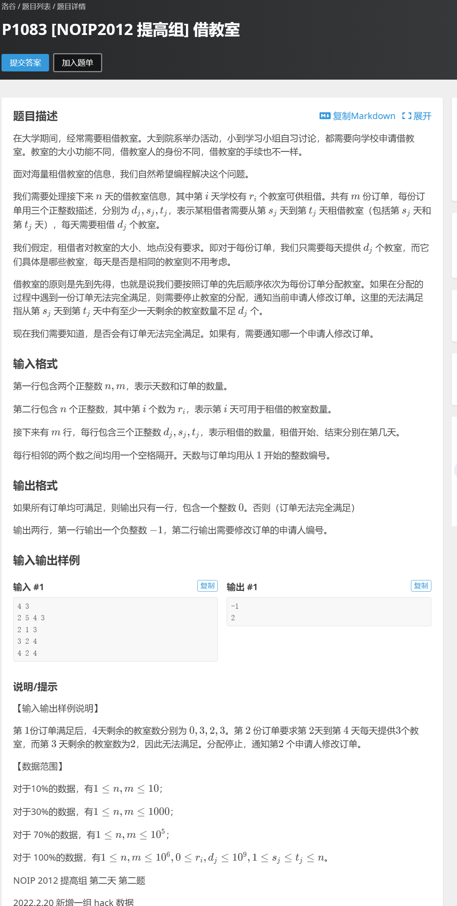


```C++
#include <bits/stdc++.h>
#define endl "\n"

using namespace std;
typedef pair<int,int> pii;
const int N = 1e6 + 10;
long long q[N],need[N],lef[N],rig[N],s[N],d[N];
long long n,m;


bool check(long long mid)
{
    memset(d,0,sizeof d);
    for (long long i = 1; i <= mid; i++)
    {
        d[lef[i]] += s[i];
        d[rig[i] + 1] -= s[i];
    }
    for (long long i = 1; i <= n; i++)
    {
        need[i] = need[i - 1] + d[i];
        if (need[i] > q[i]) return false;
    }
    return true;
}
void solve()
{
    cin >> n >> m;
    for (long long i = 1; i <= n; i++) cin >> q[i];
    for (long long i = 1; i <= m; i++) cin >> s[i] >> lef[i] >> rig[i];

    if (check(m))
    {
        cout << 0 << endl;
        return;
    }

    long long l = 1, r = m;
    while (l < r)
    {
        long long mid = l + r >> 1;
        if (check(mid)) l = mid + 1;
        else r = mid ;
    }

    cout << -1 << endl << l << endl;
}
int main()
{
    ios::sync_with_stdio(false);
    cin.tie(0),cout.tie(0);
    
    solve();    
    return 0;
}
```


## 三分

### P3382


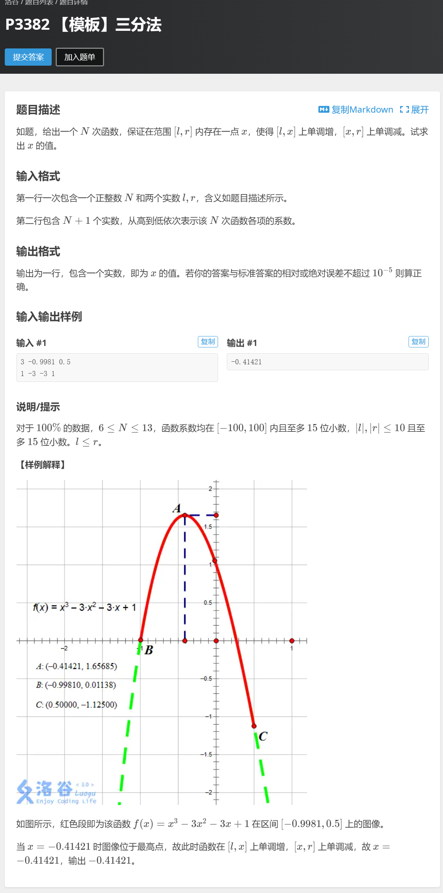

```c++
#include <bits/stdc++.h>
#define endl "\n"

using namespace std;
typedef pair<int,int> pii;
const int N = 15;
const double eps = 1e-7;
double q[N];
double n, l, r;


double f(double x)
{
    double s = 0;
    for (int i = n; i >= 0; i--) s = s * x + q[i];
    return s;
}
void solve()
{
    cin >> n >> l >> r;
    for (int i = n; i >= 0; i--) cin >> q[i];

    while (r - l > eps)
    {
        double k = (r - l) / 3;
        double mid1 = l + k , mid2 = r - k;
        if (f(mid1) > f(mid2)) r = mid2;
        else l = mid1;
    }
    
    cout << fixed << setprecision(5) << l << endl;


}
int main()
{
    ios::sync_with_stdio(false);
    cin.tie(0),cout.tie(0);
    
    solve();    
    return 0;
}
```


### P3745


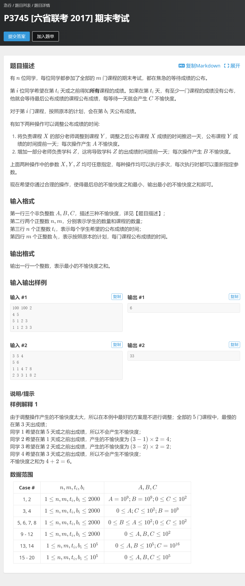

```
//只要有一门课没用结课 就有不愉快产生 所以其实是所有卷子改完的时候是一样的
#include <bits/stdc++.h>
#define endl "\n"

using namespace std;
typedef pair<int,int> pii;
const int N = 1e5 + 10;
long long n,m,t[N],b[N];
long long A,B,C,ans;
long long mi = 0x3f3f3f3f;


long long calc1(int p)
{
    long long x = 0, y = 0;
    for (int i = 1; i <= m; i++)
    {
        if (b[i] < p) x += p - b[i]; //可以被操作A推迟的天数(用来垫脚) 用来提前其他天数
        else y += b[i] - p; // 需要提前的天数
    }
    
    if (A < B) return A * min(x,y) + B *(y - min(x,y));
    else return B * y;
}

long long calc2(int p)
{
    long long sum = 0;
    for (int i = 1; i <= n; i++)
    {
        if (p > t[i]) sum += (p - t[i]) * C;
    }
    return sum;
}
void solve()
{
    cin >> A >> B >> C;
    cin >> n >> m;
    for (int i = 1; i <= n; i++)
    {
        cin >> t[i];
        mi = min(mi,t[i]);
    }
    for (int i = 1; i <= m; i++) cin >> b[i];
    if (C >= 1e16)
    {
        cout << calc1(mi) << endl;
        return;
    }
    ans = 1e16;
    int l = 1, r = N;
    while (r - l > 2)
    {
        int mid1 = l + (r - l) / 3 ,mid2 = r - (r - l) / 3;
        long long c1 = calc1(mid1) + calc2(mid1);
        long long c2 = calc1(mid2) + calc2(mid2);
        if (c1 <= c2) r = mid2;
        else l = mid1;
    }
    
    for (int i = l; i <= r; i++)
    {
        long long x = calc1(i) + calc2(i);
        ans = min(x,ans); 
    }

    cout << ans << endl;
}
int main()
{
    ios::sync_with_stdio(false);
    cin.tie(0),cout.tie(0);
    
    solve();    
    return 0;
}
```


### P1883

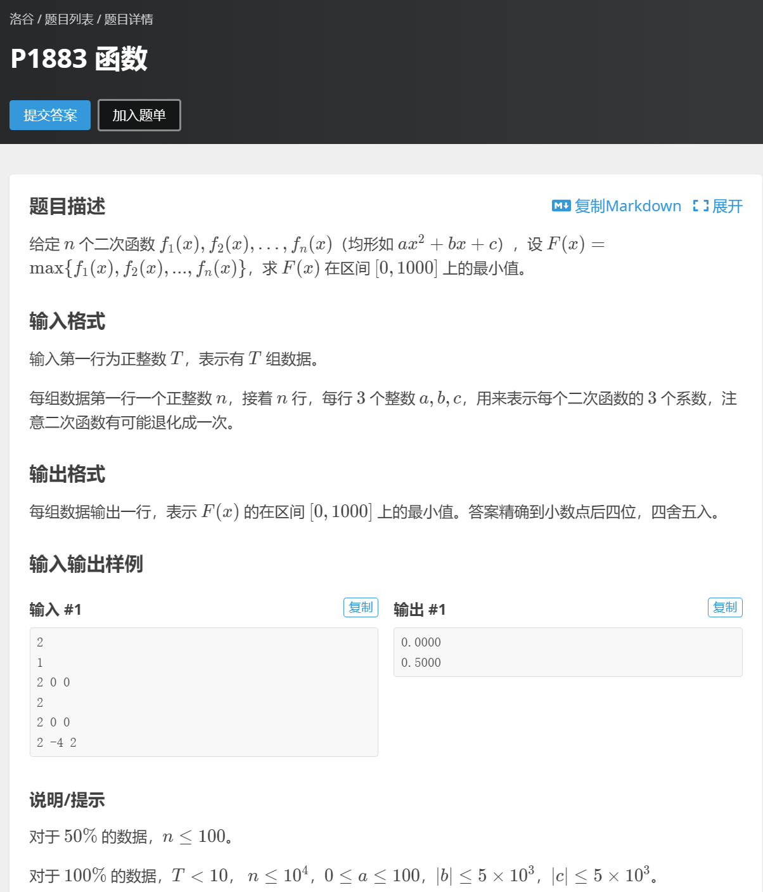


```C++
#include <bits/stdc++.h>
#define endl "\n"

using namespace std;
typedef pair<int,int> pii;
const int N = 1e4 + 10;
const double eps = 1e-11;
int a[N],b[N],c[N];
int n;

double f(double x,int i)
{
    return x * x * a[i] + x * b[i] + c[i];
}
double check(double x)
{
    double ans = f(x,1);
    for (int i = 2; i <= n; i++)
    {
        ans = max(ans,f(x,i)); // F(x) 求的就是若干个f(x)最小值的最大值
    }
    return ans;
}
void solve()
{
    cin >> n;
    for (int i = 1; i <= n; i++)
    {
        cin >> a[i] >> b[i] >> c[i];
    }

    double l = 0, r = 1000, mid1 ,mid2;

    while (r - l > eps)
    {
        mid1 = l + (r - l) / 3;
        mid2 = r - (r - l) / 3;
        if (check(mid1) > check(mid2)) l = mid1;
        else r = mid2;
    }

    cout << fixed << setprecision(4) << check(l) << endl;

}
int main()
{
    ios::sync_with_stdio(false);
    cin.tie(0),cout.tie(0);
    
    int t;
    cin >> t;
    while (t--)
    {
        solve(); 
    }   
    return 0;
}
```


## 倍增法

### P4155

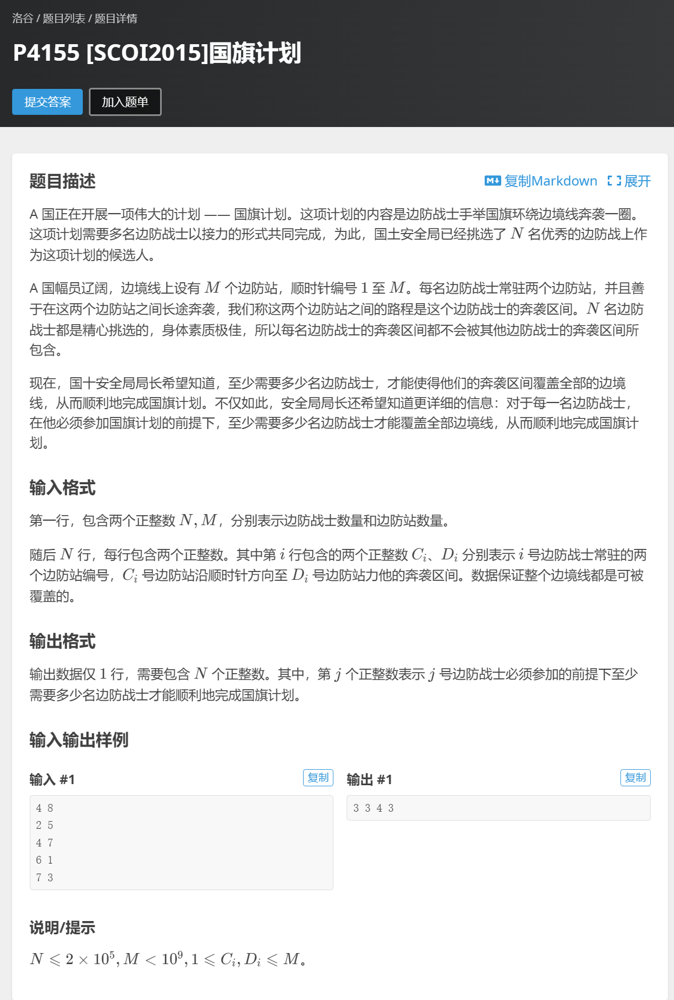


```c++
#include <bits/stdc++.h>
#define endl "\n"

using namespace std;
typedef pair<int,int> pii;
const int N = 4e5 + 10;
int n, m;

struct warrior
{
    int id,L,R;

}w[N * 2];

bool cmp(warrior w1,warrior w2)
{
    return w1.L < w2.L;
}

int n2;
int go[N][20];
int res[N];

void init()
{
    int next = 1;
    for (int i = 1; i <= n2; i++)
    {
        while (next <= n2 && w[next].L <= w[i].R) next++;
        go[i][0] = next - 1; 
    }

    for (int i = 1; (1 << i) <= n; i++)
    {
        for (int s = 1; s <= n2; s++)
        {
            go[s][i] = go[go[s][i - 1]][i - 1];
        }
    }
}

void getans(int x)
{
    int len = w[x].L + m, cur = x, ans = 1;
    for (int i = __lg(N); i >= 0; i--)
    {
        int pos = go[cur][i];
        if (pos && w[pos].R < len)
        {
            ans += 1 << i;
            cur = pos;
        }
    }
    res[w[x].id] = ans + 1;
}
void solve()
{
    cin >> n >> m;
    for (int i = 1; i <= n; i++)
    {
        w[i].id = i;
        cin >> w[i].L >> w[i].R;
        if (w[i].R < w[i].L) w[i].R += m;
    }
    sort(w + 1, w + n + 1,cmp);

    n2 = n;
    for (int i = 1; i <= n; i++)
    {
        n2++;
        w[n2] = w[i], w[n2].L = w[i].L + m, w[n2].R = w[i].R + m;
    }
    init();
    for (int i = 1; i <= n; i++) getans(i);
    for (int i = 1; i <= n; i++) cout << res[i] << " ";
}
int main()
{
    ios::sync_with_stdio(false);
    cin.tie(0),cout.tie(0);
    
    solve();    
    return 0;
}
```


## ST算法

### P2880

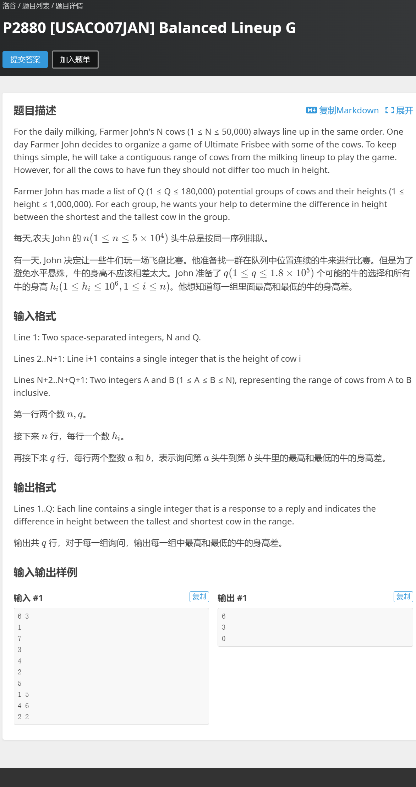

```c++
#include <bits/stdc++.h>
#define endl "\n"

using namespace std;
typedef pair<int,int> pii;
const int N = 50010;
int n,m;
int a[N],dp_max[N][22],dp_min[N][21];

int query(int l,int r)
{
    int k = __lg(r - l + 1);
    int x = max(dp_max[l][k], dp_max[r - (1 << k) + 1][k]);
    int y = min(dp_min[l][k], dp_min[r - (1 << k) + 1][k]);
    return x - y;
}
void init()
{
    for (int i = 1; i <= n; i++)
    {
        dp_max[i][0] = a[i];
        dp_min[i][0] = a[i];
    }

    int p = __lg(n);

    for (int k = 1; k <= p; k++)
    {
        for (int s = 1; s + (1 << k) <= n + 1; s++)
        {
            dp_max[s][k] = max(dp_max[s][k - 1], dp_max[s + (1 << (k - 1))][k - 1]);
            dp_min[s][k] = min(dp_min[s][k - 1], dp_min[s + (1 << (k - 1))][k - 1]);
        }
    }
}
void solve()
{
    cin >> n >> m;
    for (int i = 1; i <= n; i++) cin >> a[i];
    init();
    
    for (int i = 1; i <= m; i++)
    {
        int l, r;
        cin >> l >> r;
        cout << query(l,r) << endl;
    }
}
int main()
{
    ios::sync_with_stdio(false);
    cin.tie(0),cout.tie(0);
    
    solve();    
    return 0;
}

```


## 排列与排序

### P1093

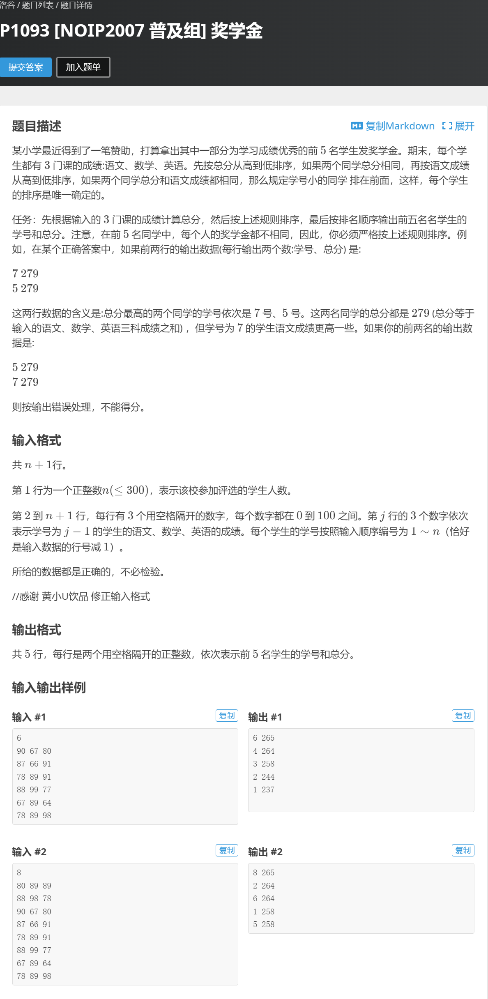

```C++
#include <bits/stdc++.h>
#define endl "\n"

using namespace std;
typedef pair<int,int> pii;
struct stu
{
    int id;
    int c,m,e;
    int sum;
}st[310];

bool cmp(stu a,stu b)
{
    if (a.sum > b.sum) return true;
    else if (a.sum < b.sum) return false;
    else
    {
        if (a.c > b.c) return true;
        else if (a.c < b.c) return false;
        else
        {
            if (a.id < b.id) return true;
            else return false;
        } 
    }
}

void solve()
{
    int n;
    cin >> n;
    for (int i = 1; i <= n; i++)
    {
        cin >> st[i].c >> st[i].m >> st[i].e;
        st[i].sum = st[i].c + st[i].m + st[i].e;
        st[i].id = i;
    }
    sort(st + 1, st + n + 1,cmp);
    for (int i = 1; i <= 5; i++)
    {
        cout << st[i].id << " " << st[i].sum <<endl;
    }
}
int main()
{
    ios::sync_with_stdio(false);
    cin.tie(0),cout.tie(0);
    
    solve();    
    return 0;
}
```


# 搜索

## DFS

### P1019

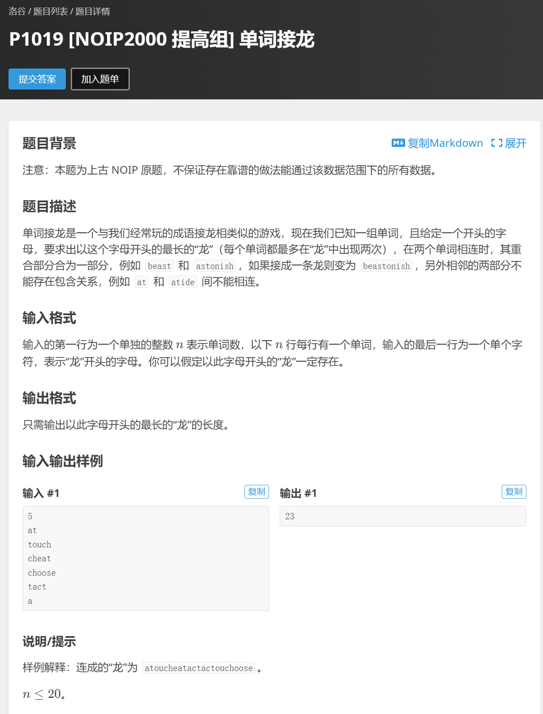


```c++
#include <bits/stdc++.h>
#define endl "\n"

using namespace std;
typedef pair<int,int> pii;
const int N = 30;
int n, ans;
string s[N];
int use[N];

int check(string str1,string str2)
{
    int n1 = str1.size();
    int n2 = str2.size();
    for (int i = 1; i < min(n1, n2); i++)
    {
        int flag = 1;
        for (int j = 0; j < i; j++)
        {
            if (str1[n1 - i + j] != str2[j]) flag = 0;
        }
        if (flag) return i;
    }
    return 0;
}
void dfs(string str,int len)
{
    ans = max(ans, len);
    for (int i = 0; i < n; i++)
    {
        if (use[i] >= 2) continue;
        int c = check(str,s[i]);
        if (c > 0)
        {
            use[i]++;
            dfs(s[i], len + s[i].size() - c);
            use[i]--;
        }
    }
}
void solve()
{
    cin >> n;
    for (int i = 0; i <= n; i++) cin >> s[i];
    dfs(' '+ s[n],1);
    cout << ans << endl;

}
int main()
{
    ios::sync_with_stdio(false);
    cin.tie(0),cout.tie(0);
    
    solve();    
    return 0;
}
```

### P5194

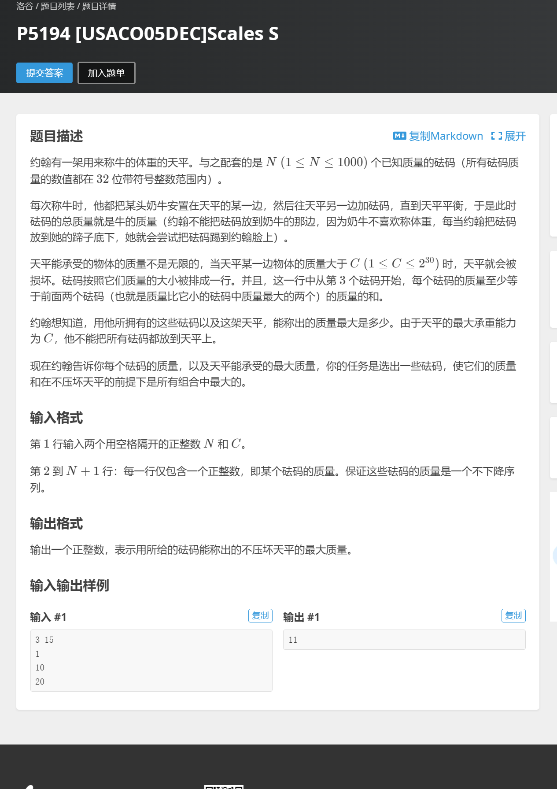


```c++
#include <bits/stdc++.h>
#define endl "\n"

using namespace std;
typedef pair<int,int> pii;
const int N = 55;
long long a[N], sum[N];
long long n, c, ans;

void dfs(int cur, long long res)
{
    if (res > c) return;
    if (res + sum[cur - 1] <= c)
    {
        ans = max(ans, res + sum[cur - 1]);
        return;
    }
    ans = max(ans, res);
    for (int i = 1; i <= cur - 1; i++) dfs(i, res + a[i]);
}
void solve()
{
    cin >> n >> c;

    for (int i = 1; i <= n; i++) cin >> a[i];
    for (int i = 1; i <= n; i++) sum[i] = sum[i - 1] + a[i];
    dfs(n + 1,0);
    cout << ans << endl;
}
int main()
{
    ios::sync_with_stdio(false);
    cin.tie(0),cout.tie(0);
    
    solve();    
    return 0;
}
```


### P1378

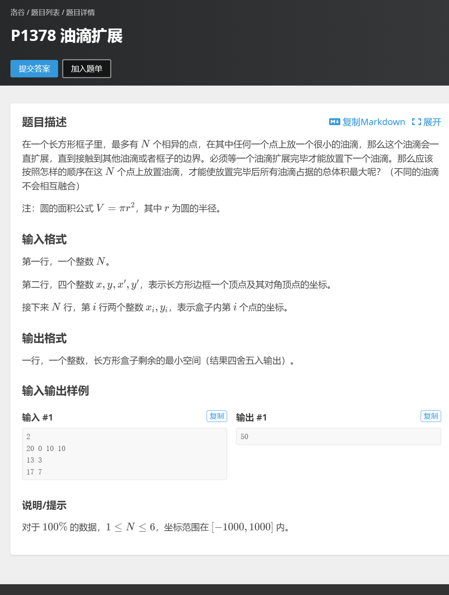


```C++
#include <bits/stdc++.h>
#define endl "\n"

using namespace std;
typedef pair<int,int> pii;
const int N = 10;
const double PI = acos(-1);
int st[N];
double x[N], y[N], r[N], xa, ya, xb, yb, ans;
int n;

double cal(int i)
{
    double x1 = min(abs(x[i] - xa), abs(x[i] - xb));
    double y1 = min(abs(y[i] - ya), abs(y[i] - yb));
    double ans_r = min(x1, y1);

    for (int j = 1; j <= n; j++)
    {
        if (i != j && st[j])
        {
            double d = sqrt((x[i] - x[j]) * (x[i] - x[j]) + (y[i] - y[j]) * (y[i] - y[j]));
            ans_r = min(ans_r, max(d - r[j], 0.0));
        }

    }
    return ans_r;
}
void dfs(int u, double sum)
{
    if (u > n)
    {
        ans = max(ans, sum);
        return;
    }
    for (int i = 1; i <= n; i++)
    {
        if (!st[i])
        {
            r[i] = cal(i);
            st[i] = 1;
            dfs(u + 1, sum + r[i] * r[i] * PI);
            st[i] = 0;
        }
    }
}
void solve()
{
    cin >> n;
    cin >> xa >> ya >> xb >> yb;
    int area = abs(xa - xb) * abs(ya - yb);
    for (int i = 1; i <= n; i++)
    {
        cin >> x[i] >> y[i];
    }

    dfs(1, 0);

    cout << fixed << setprecision(0) << double (area) - ans << endl;
}
int main()
{
    ios::sync_with_stdio(false);
    cin.tie(0),cout.tie(0);
    
    solve();    
    return 0;
}
```


### P1162

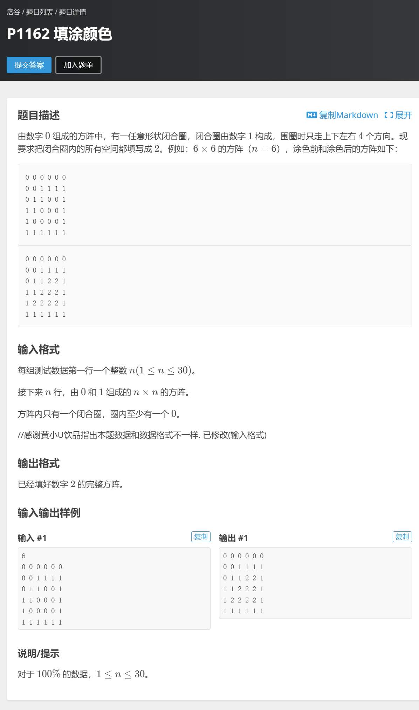


```C++
#include <bits/stdc++.h>
#define endl "\n"

using namespace std;
typedef pair<int,int> pii;
int mp[35][35], st[35][35];
int d[4][2] = {{0,1},{0,-1},{1,0},{-1,0}};
int n;
void dfs(int x, int y)
{
    if (x < 0 || x > n + 1 || y <0 || y > n + 1 || st[x][y] != 0) return;
    st[x][y] = 1;
    for (int i = 0; i < 4; i++) dfs(x + d[i][0], y + d[i][1]);
}
void solve()
{
    cin >> n;
    for (int i = 1; i <= n; i++)
    {
        for (int j = 1; j <= n; j++)
        {
            cin >> mp[i][j];
            if (mp[i][j] == 0) st[i][j] = 0;
            else st[i][j] = 1; 
        }
    }

    dfs(0, 0);

    for (int i = 1; i <= n; i++)
    {
        for (int j = 1; j <= n; j++)
        {
            if (st[i][j] == 0) cout << 2 << " ";
            else cout << mp[i][j] << " ";
        }
        cout << endl;
    }
}
int main()
{
    ios::sync_with_stdio(false);
    cin.tie(0),cout.tie(0);
    
    solve();    
    return 0;
}
```


## BFS

### P1162

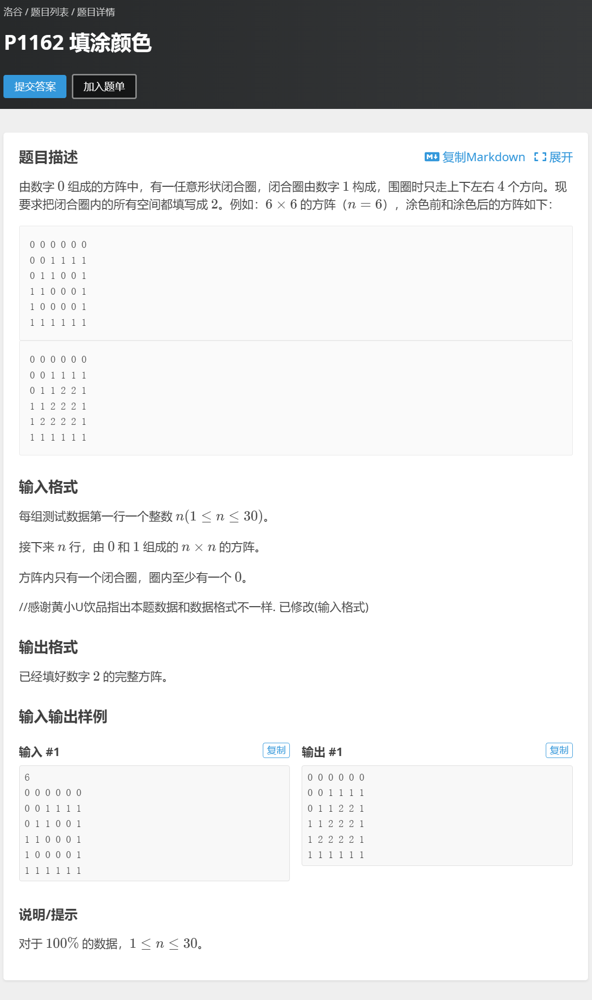


```c++
//从边界往里面bfs 如果进不去就标记为1 即不是闭合的
#include <bits/stdc++.h>
#define endl "\n"

using namespace std;
typedef pair<int,int> pii;
const int N = 35;
int mp[N][N];
int st[N][N];
int n;
int d[4][2] = {{0,1},{0,-1},{1,0},{-1,0}};

queue<pii> q;

void bfs(int x,int y)
{
    st[x][y] = 1;
    q.push({x,y});
    while (q.size())
    {
        pii t = q.front();
        q.pop();
        for (int i = 0; i < 4; i++)
        {
            int nx = t.first + d[i][0], ny = t.second + d[i][1];
            if (mp[nx][ny] == 0 && nx != n + 1 && nx != 0 && ny != n + 1 && ny != 0 && !st[nx][ny])
            {
                st[nx][ny] = 1;
                q.push({nx,ny});
            }
        }
    }
}
void solve()
{
    cin >> n;
    for (int i = 1; i <= n; i++)
    {
        for (int j = 1; j <= n; j++)
        {
            cin >> mp[i][j];
            if (mp[i][j] == 1) st[i][j] = 1;
        }
    }

    for (int i = 1; i <= n; i = i + n - 1)
    {
        for (int  j = 1; j <= n; j++)
        {
            if (st[i][j] == 1) continue;
            bfs(i,j);
        }
    }

    for (int j = 1; j <= n; j = j + n - 1)
    {
        for (int i = 1; i <= n; i++)
        {
            if (st[i][j] == 1) continue;
            bfs(i,j);
        }
    }

    for (int i = 1; i <= n; i++)
    {
        for (int j = 1; j <= n; j++)
        {
            if (!st[i][j]) cout << 2 << " ";
            else cout << mp[i][j] << " ";
        }
        cout << endl;
    }
}
int main()
{
    ios::sync_with_stdio(false);
    cin.tie(0),cout.tie(0);
    
    solve();    
    return 0;
}
```

### P1443


```C++
#include <bits/stdc++.h>
#define endl "\n"

using namespace std;
typedef pair<int,int> pii;
const int N = 410;
int mp[N][N];
int st[N][N];
int n,m;
int g,z;
int cnt = 0;
int d[8][2] = {{1,2},{2,1},{-1,2},{-2,1},{1,-2},{2,-1},{-1,-2},{-2,-1}};
queue<pii> q;
void bfs(int x,int y)
{
    q.push({x,y});
    while (q.size())
    {
        pii t= q.front();
        q.pop();
        cnt = (mp[t.first][t.second] == -1 ? 0 : mp[t.first][t.second]);
        for (int i = 0; i < 8; i++)
        {
            int nx = t.first + d[i][0], ny = t.second + d[i][1];
            if (!st[nx][ny] && nx >= 1 && ny <= m && nx <=n && ny >= 1)
            {
                mp[nx][ny] = cnt + 1;
                st[nx][ny] = 1;
                q.push({nx,ny});
            }
        }
    }
}
void solve()
{
    memset(mp,-1,sizeof mp);
    cin >> n >> m >> g >> z;
    bfs(g, z);
    mp[g][z] = 0;
    for (int i = 1; i <= n; i++)
    {
        for (int j = 1; j <= m; j++)
        {
            cout << mp[i][j] << " ";
        }
        cout << endl;
    }
}
int main()
{
    ios::sync_with_stdio(false);
    cin.tie(0),cout.tie(0);
    
    solve();    
    return 0;
}
```

