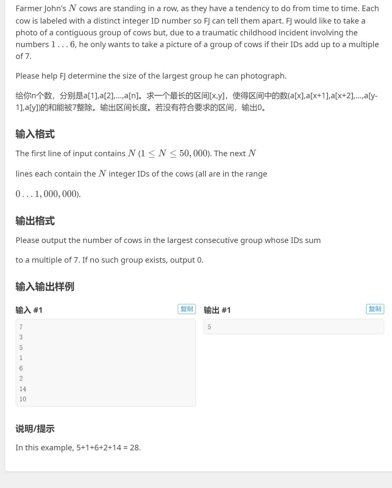
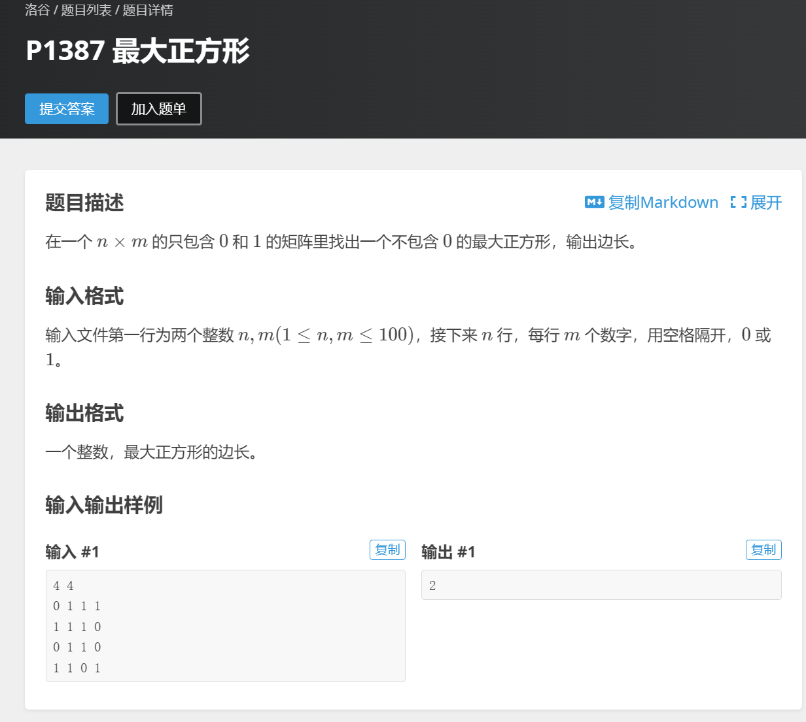

# Part2 基础算法

## Part2.8 前缀和 & 差分

### P3131

 

**这里需要用到一个小定理：若两个数相减 ( mod (mod 7=0)7=0) ，那么这两个数 mod mod 77 的余数一定相同！！（很好证明，自己有兴趣不妨去试试证明）**

```c++
#include <bits/stdc++.h>
#define endl "\n"

using namespace std;
typedef pair<int,int> pii;
const int N = 500010;
int q[N];
unordered_map<int,int> m1,m2;
int ans = -1;

void solve()
{
    int n;
    cin >> n;

    for (int i = 1; i <= n; i++)
    {
        cin >> q[i];
        q[i] = (q[i] + q[i - 1]) % 7;//%7意义下的前缀和 ，就变成了前缀和%7的余数；
    }

    for (int i = 1; i <= n; i++)
    {
        m1[q[i]] = i;//最后一次出现q[i]这个余数的时候的位置为i 
    }

    for (int i = n; i >= 1; i--)
    {
        m2[q[i]] = i;//第一次出现q[i]这个余数的时候的位置为i 
    }
    m2[0] = 0;

    for (int i = 0; i <= 6; i++)
    {
        ans = max(ans,m1[i] - m2[i]);
    }
    cout << ans << endl;
}
int main()
{
    ios::sync_with_stdio(false);
    cin.tie(0),cout.tie(0);
    
    solve();    
    return 0;
}
```

### P1387 最大正方形



```C++
#include <bits/stdc++.h>
#define endl "\n"

using namespace std;
typedef pair<int,int> pii;
const int N = 110;
int q[N][N],dp[N][N];
int ans;
//对于一个已经确定的dp[i][j]=x，它表明包括节点i，j在内向上x个节点，向左x个节点扫过的正方形中所有a值都为1；
//只有q[i][j]==1时，节点i,j才能作为正方形的右下角；
//dp[i][j]表示以节点i,j为右下角，可构成的最大正方形的边长。
void solve()
{
    int n,m;
    cin >> n >> m;

    for (int i = 1; i <= n; i++)
    {
        for (int j = 1; j <= m; j++)
        {
            cin >> q[i][j];
            if (q[i][j] == 1) dp[i][j] = min({dp[i - 1][j],dp[i - 1][j - 1],dp[i][j - 1]}) + 1;
            ans = max(dp[i][j],ans);
        }
    }

    cout << ans << endl;
}

int main()
{
    ios::sync_with_stdio(false);
    cin.tie(0),cout.tie(0);

    solve();

    return 0;
}
```

