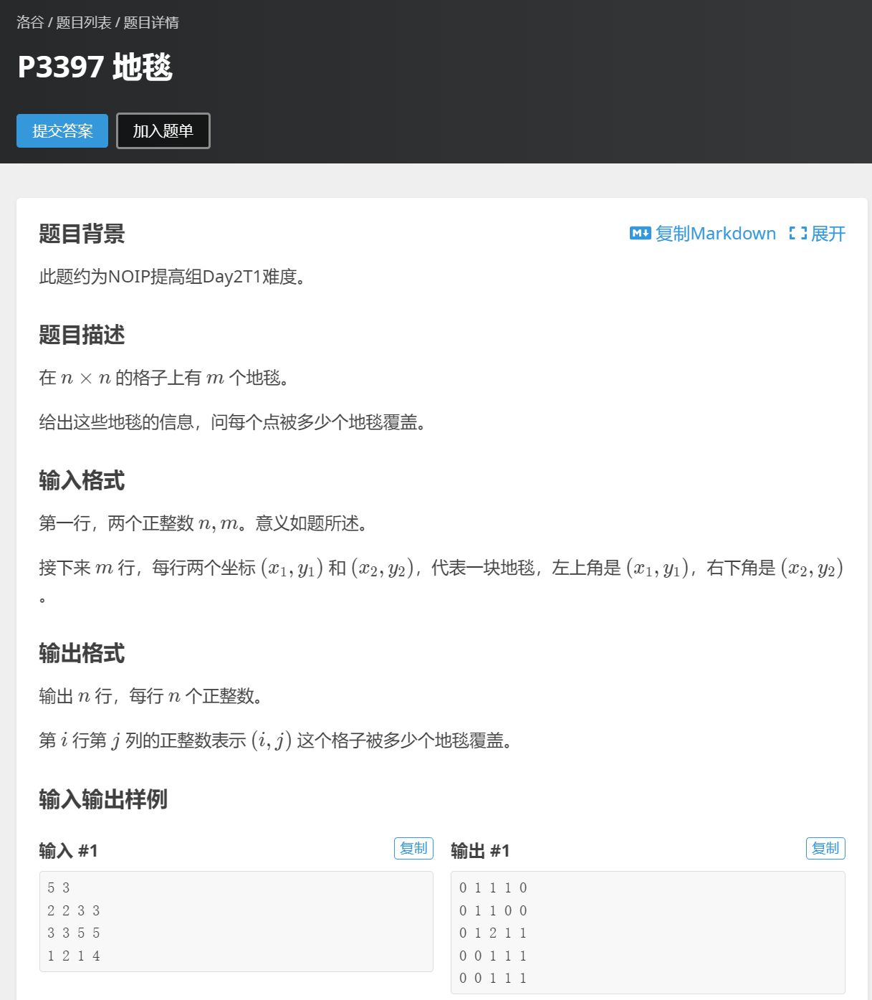
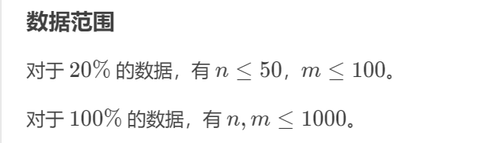
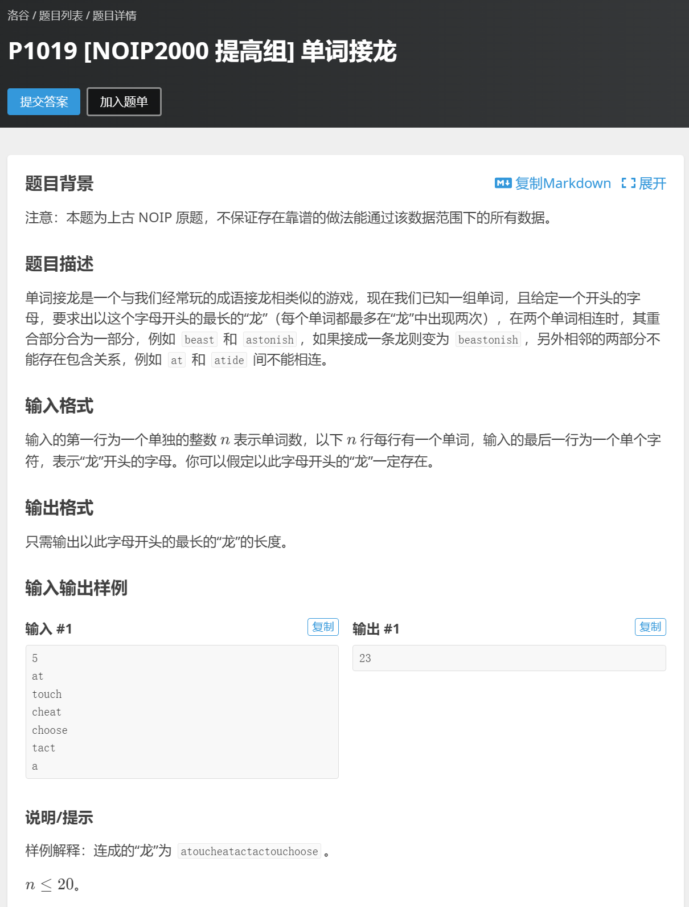

# Part2 基础算法

## Part2.8 前缀和 & 差分

### P3131

 

**这里需要用到一个小定理：若两个数相减 ( mod (mod 7=0)7=0) ，那么这两个数 mod mod 77 的余数一定相同！！（很好证明，自己有兴趣不妨去试试证明）**

```c++
#include <bits/stdc++.h>
#define endl "\n"

using namespace std;
typedef pair<int,int> pii;
const int N = 500010;
int q[N];
unordered_map<int,int> m1,m2;
int ans = -1;

void solve()
{
    int n;
    cin >> n;

    for (int i = 1; i <= n; i++)
    {
        cin >> q[i];
        q[i] = (q[i] + q[i - 1]) % 7;//%7意义下的前缀和 ，就变成了前缀和%7的余数；
    }

    for (int i = 1; i <= n; i++)
    {
        m1[q[i]] = i;//最后一次出现q[i]这个余数的时候的位置为i 
    }

    for (int i = n; i >= 1; i--)
    {
        m2[q[i]] = i;//第一次出现q[i]这个余数的时候的位置为i 
    }
    m2[0] = 0;

    for (int i = 0; i <= 6; i++)
    {
        ans = max(ans,m1[i] - m2[i]);
    }
    cout << ans << endl;
}
int main()
{
    ios::sync_with_stdio(false);
    cin.tie(0),cout.tie(0);
    
    solve();    
    return 0;
}
```

### P1387 最大正方形


```C++
#include <bits/stdc++.h>
#define endl "\n"

using namespace std;
typedef pair<int,int> pii;
const int N = 110;
int q[N][N],dp[N][N];
int ans;
//对于一个已经确定的dp[i][j]=x，它表明包括节点i，j在内向上x个节点，向左x个节点扫过的正方形中所有a值都为1；
//只有q[i][j]==1时，节点i,j才能作为正方形的右下角；
//dp[i][j]表示以节点i,j为右下角，可构成的最大正方形的边长。
void solve()
{
    int n,m;
    cin >> n >> m;

    for (int i = 1; i <= n; i++)
    {
        for (int j = 1; j <= m; j++)
        {
            cin >> q[i][j];
            if (q[i][j] == 1) dp[i][j] = min({dp[i - 1][j],dp[i - 1][j - 1],dp[i][j - 1]}) + 1;
            ans = max(dp[i][j],ans);
        }
    }

    cout << ans << endl;
}

int main()
{
    ios::sync_with_stdio(false);
    cin.tie(0),cout.tie(0);

    solve();

    return 0;
}
```

### P3397 地毯





```C++
#include <bits/stdc++.h>
#define endl "\n"

using namespace std;
typedef pair<int,int> pii;

const int N = 1001;
int q[N][N];

void solve()
{
    int n,m;
    cin >> n >> m;
    vector<pii> v;
    while (m--)
    {
        int x1,y1,x2,y2;
        cin >> x1 >> y1 >> x2 >> y2;
        
        for (int i = x1; i <= x2; i++)
        {
            for (int j = y1; j <= y2; j++)
            {
                q[i][j]++;
            }
        }
    }

    for (int i = 1; i <= n; i++)
    {
        for (int j = 1; j <= n; j++)
        {
            cout << q[i][j] << " ";
        }
        cout << endl;
    }
}
int main()
{
    ios::sync_with_stdio(false);
    cin.tie(0),cout.tie(0);
    
    solve();    
    return 0;
}
```


# Part3 搜索

## Part3.1 深度优先搜索

### P1019 [NOIP2000 提高组] 单词接龙



注意:dfs时候N一定要开很大！！！！！ 同时一定下标从0开始！！！！

```c++
#include <bits/stdc++.h>

const int N = 40;
using namespace std;

int g[N][N];
int col[N],dg[N],udg[N];
int n,cnt;

void dfs(int u)
{
    if (u == n)
    {
        cnt++;

        if (cnt <= 3)
        {
            for (int i = 0; i < n; i++)
            {
                for (int j = 0; j < n; j++)
                {
                    if (g[i][j] == 1) cout << j + 1 << " ";
                }
            }
            cout << endl;
        }
        return;
    }

    for (int i = 0; i < n; i++)
    {
        if (!col[i] && !dg[u + i] && !udg[n + i - u]) //判断对角线
        {
            g[u][i] = 1;
            col[i] = dg[u + i] = udg[n + i - u] = 1;
            dfs(u + 1);
            col[i] = dg[u + i] = udg[n + i - u] = 0;
            g[u][i] = 0;
        }
    }
}
int main()
{
    ios::sync_with_stdio(false);
    cin.tie(0),cout.tie(0);
    
    cin >> n;
    dfs(0);
    cout << cnt << endl;
    return 0;
}
```


 
