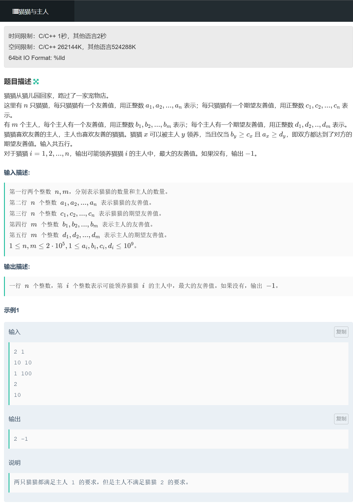
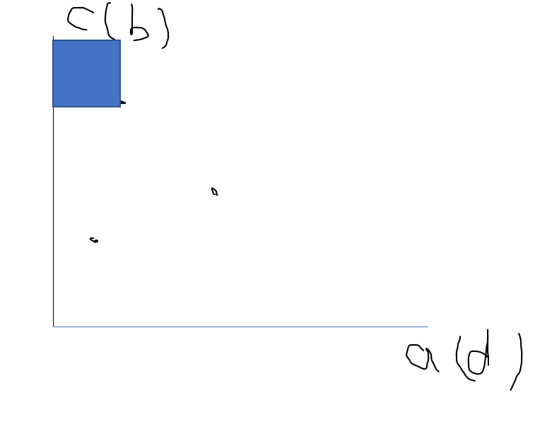

# D.猫猫与主人



离线询问




图中小点表示小猫

只要human在小猫的左上角的阴影区域就行，找到其中最大的b，这就需要预处理.

```C++
#include <bits/stdc++.h>
#define endl "\n"

using namespace std;
typedef pair<int,int> pii;

const int N = 200010;
int n,m,ans[N],mx[N];

struct Cat
{
    int fri,exp,id;
}cat[N];

struct Human
{
    int fri,exp;
}human[N];

bool cmp1(Cat x,Cat y)
{
    return x.fri < y.fri;
}

bool cmp2(Human x,Human y)
{
    return x.exp < y.exp;
}
void solve()
{
    cin >> n >> m;

    for (int i = 1; i <= n; i++) cin >> cat[i].fri , cat[i].id = i;
    for (int i = 1; i <= n; i++) cin >> cat[i].exp;
    for (int i = 1; i <= m; i++) cin >> human[i].fri;
    for (int i = 1; i <= m; i++) cin >> human[i].exp;

    sort(cat + 1,cat + n + 1,cmp1);
    sort(human + 1,human + m + 1,cmp2);

    for (int i = 1; i <= m; i++) mx[i] = max(mx[i - 1],human[i].fri);
    
    int j = 1;
    for (int i = 1; i <= n; i++) // 这一步的复杂度为n + m 而不是 n * m ,指针 j 只会往右边移动而不会回去.
    {
        while (j <= m && human[j].exp <= cat[i].fri) j++;
        if (mx[j - 1] >= cat[i].exp) ans[cat[i].id] = mx[j - 1];
        else ans[cat[i].id] = -1;
    }

    for (int i = 1; i <= n; i++) cout << ans[i] << " ";
}
int main()
{
    ios::sync_with_stdio(false);
    cin.tie(0),cout.tie(0);
    
    solve();    
    return 0;
}
```

